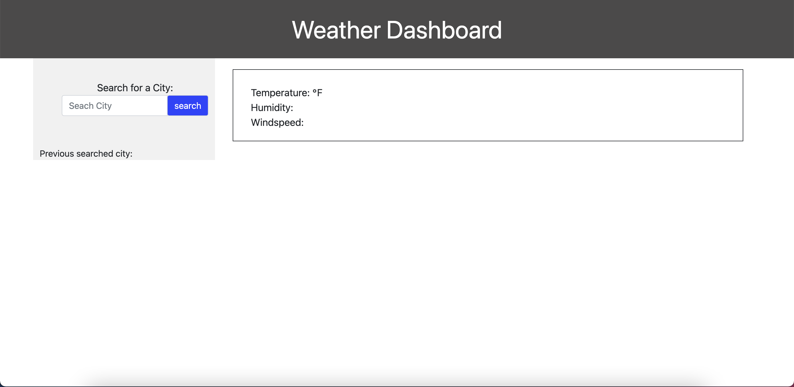
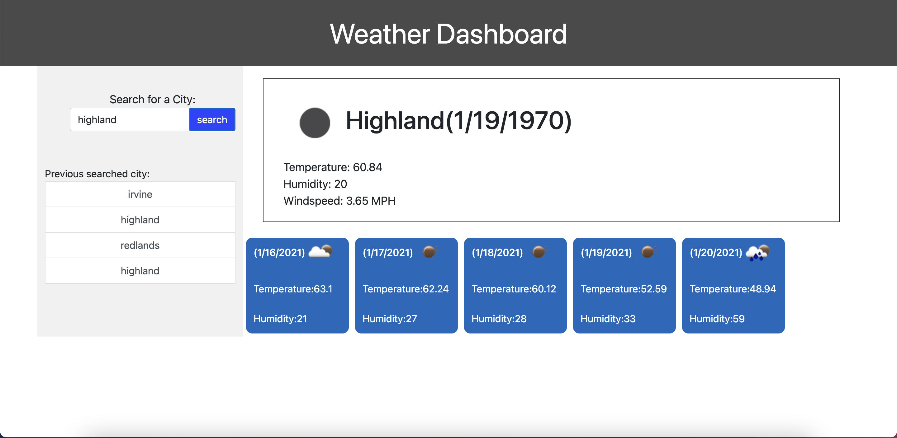

# Weather-Dashboard

The Weather Dashboard is a webpage that will display daily weather as well as a 5 day forecast. The webpage allows the user to search any city in the United States.The current weather will display an icon of the current weather as well as the temperature, humidity, and wind speed. The 5 day forescast will also present a icon with the temeperature and humidity. When the user inputs another city the previous city will be placed under the search bar. When the user clcks on the previous city it will display the information again. 
 
# How to use:

When the webpage is generated the user will see a search bar where they will search the city that they choose.

The current weather will be displayed along with the 5 day forecast.

When the user searches another city the previous city searched will be saved below the search bar. 

Heres a link to the deployed application:

https://mdelgado1128.github.io/Weather-Dashboard/

Here is my Github repository:

https://github.com/mdelgado1128/Weather-Dashboard

